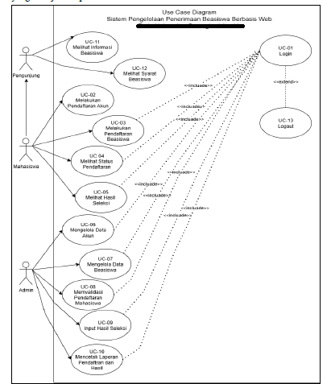
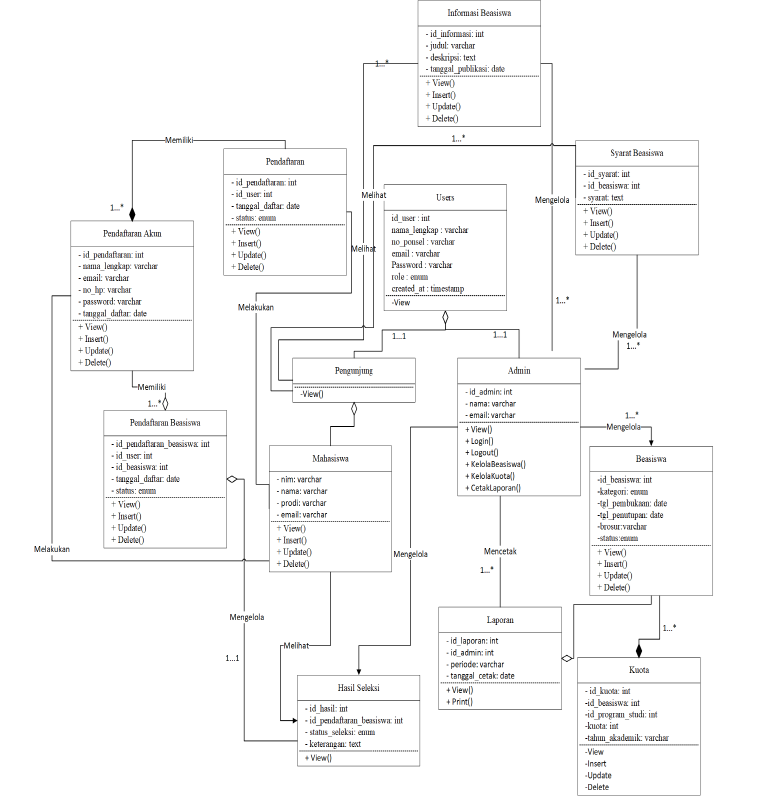
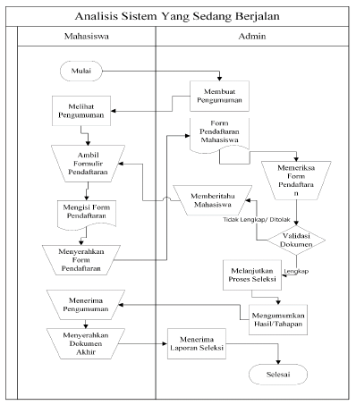
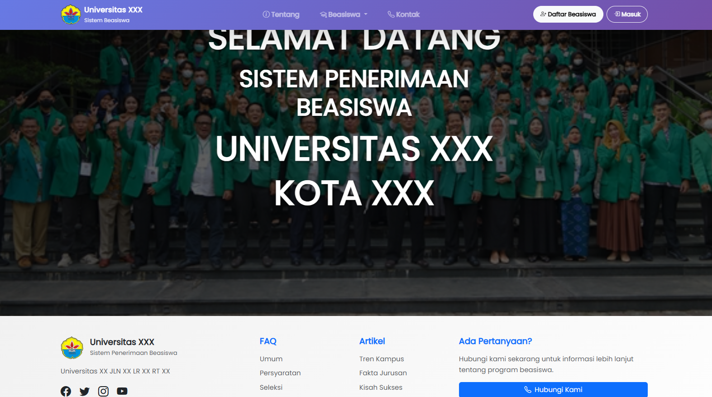
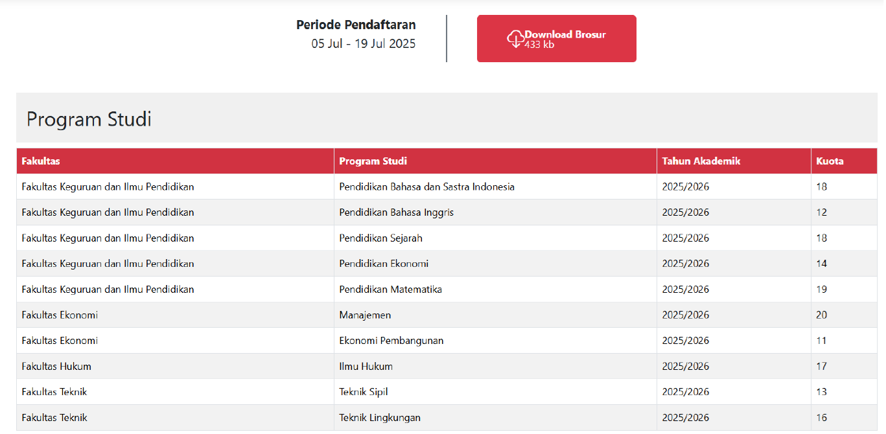
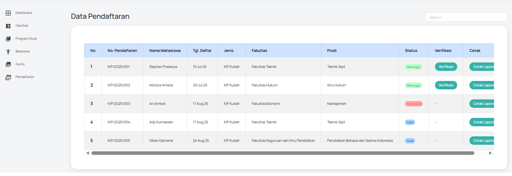

# Sistem Informasi Manajemen Beasiswa

Sistem Informasi Manajemen Beasiswa merupakan aplikasi berbasis web
yang dirancang untuk mengelola proses pendaftaran, seleksi,
dan administrasi beasiswa secara terstruktur, terintegrasi,
dan efisien.

Sistem ini bertujuan untuk membantu pihak pengelola
dalam memantau seluruh proses beasiswa
mulai dari pendaftaran hingga penetapan penerima beasiswa.

---

## Latar Belakang

Pengelolaan beasiswa secara manual
sering menimbulkan berbagai permasalahan,
seperti ketidakteraturan data,
proses seleksi yang memakan waktu,
serta kesulitan dalam memantau
status pendaftar dan penerima beasiswa.

Dengan memanfaatkan sistem informasi berbasis web,
proses pengelolaan beasiswa
dapat dilakukan secara terintegrasi,
transparan, dan mudah diakses
oleh pihak yang berkepentingan.

---

## Tujuan Sistem

Tujuan dari pengembangan sistem ini adalah:
- Mengelola data pendaftar beasiswa secara digital
- Mendukung proses seleksi dan verifikasi beasiswa
- Mempermudah pengelolaan administrasi beasiswa
- Meningkatkan efisiensi dan transparansi
  dalam pengelolaan program beasiswa

---

## Ruang Lingkup Sistem

Sistem Informasi Manajemen Beasiswa ini mencakup:
- Pendaftaran beasiswa oleh mahasiswa
- Pengelolaan data pendaftar dan penerima beasiswa
- Proses seleksi dan verifikasi data pendaftar
- Pengelolaan informasi dan pengumuman beasiswa
- Pembuatan laporan dan rekapitulasi data

---

## Metodologi Pengembangan

Pengembangan sistem dilakukan
menggunakan pendekatan
**System Development Life Cycle (SDLC)**,
yang meliputi tahapan berikut:
1. Analisis kebutuhan sistem
2. Perancangan sistem
3. Implementasi sistem
4. Pengujian sistem

---

## Diagram Sistem

### Use Case Diagram
Diagram use case menggambarkan
interaksi antara pengguna
(mahasiswa dan admin)
dengan Sistem Informasi Manajemen Beasiswa.

  

---

### Class Diagram
Class diagram menunjukkan struktur kelas,
atribut, serta relasi antar kelas
yang digunakan dalam pengembangan sistem.

  

---

### Analisis Sistem Berjalan
Diagram ini menggambarkan alur sistem
yang sedang berjalan
sebelum dilakukan pengembangan sistem baru.

  

---

## Fitur Utama

Fitur-fitur utama yang tersedia dalam sistem ini meliputi:
- Manajemen data pendaftar beasiswa
- Proses seleksi dan verifikasi beasiswa
- Manajemen data penerima beasiswa
- Dashboard administrasi
- Laporan dan rekapitulasi data

---

## Pratinjau Aplikasi

Berikut merupakan beberapa tampilan antarmuka
dari Sistem Informasi Manajemen Beasiswa berbasis web.

### Halaman Beranda

  

### Halaman Beranda (Versi Alternatif)

  

### Halaman Pendaftaran Admin

  

---
